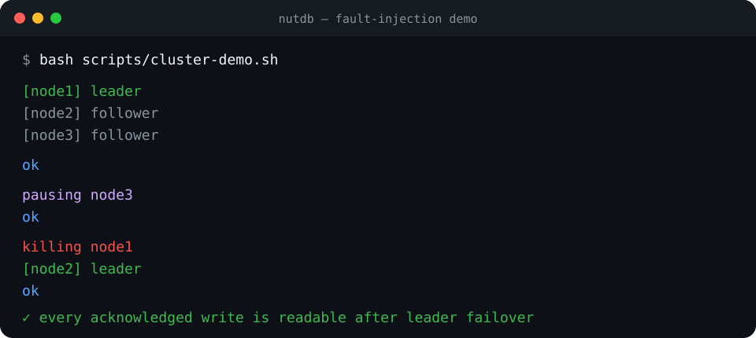
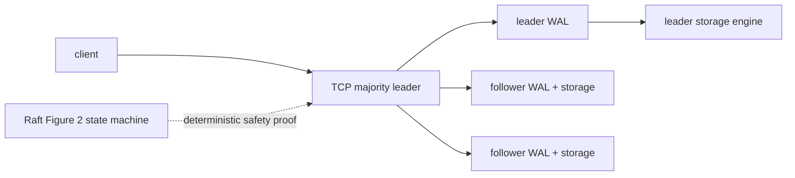

<h1 align="center">nutdb</h1>

<p align="center">
  <em>A distributed SQL database written from scratch in Rust — built from the
  durability layer up: write-ahead logging, MVCC, a SQL engine, and Raft
  replication. No database dependencies.</em>
</p>

<p align="center">
  
  
  
  
</p>

<p align="center">
  <a href="docs/assets/cluster-failover.cast">
    
  </a>
</p>

The recording above is produced by the real
[`scripts/cluster-demo.sh`](scripts/cluster-demo.sh): node 3 is paused, node 1
is killed, node 2 continues on the majority, and every acknowledged write is
read back. Click it for the asciinema v2 recording.

## Measured results

Release build on WSL2/Linux 6.6, Intel i7-13650HX, Windows-mounted storage.
Every durability path uses `sync_file`; these are three-sample medians from
`cargo run --release -- bench`, not in-memory microbenchmarks.

| benchmark | result |
|---|---:|
| single writes, fsync each | 335 ops/s |
| group commit, one fsync | 27,357 ops/s |
| MVCC snapshot reads with a concurrent writer | 150,116 ops/s |
| single write latency | 2.981 ms/op |
| 3-node replicated write latency | 54.736 ms/op |
| reopen and replay 10,000 records | 6.848 ms |

Counts and conditions are printed by the benchmark. Results vary with storage
and scheduler; the important visible cost is synchronous replication versus a
single durable write.

---

## What this is

Most "build a database" projects start with SQL parsing. nutdb starts where a
database earns the right to be called one: **not losing your data.** Milestone 0
is a checksummed write-ahead log and a store that survives a crash at any point,
including *mid-write*. Everything after — transactions, SQL, replication — is
built on that foundation.

```
set(k, v) ──▶ append to WAL ──▶ fsync ──▶ update memory ──▶ return
                                  ▲
                  a crash before this loses the write;
                  a crash after it does not; a crash *during*
                  it is detected by the checksum and discarded
```

## Storage result — durability plus bounded recovery

```
$ cargo run --release -- demo
nutdb milestone 0 — write-ahead log durability

opening a fresh store at data/demo.wal
  set user:1 = ada
  set user:2 = grace
  set user:3 = alan
  set temp = scratch
  delete temp
  3 keys live, log is 126 bytes

process 'crashes' — reopening from the log only
  replayed 5 records (truncated: false)
  keys recovered: ["user:1", "user:2", "user:3"]

durability verified: every committed write survived, the delete stuck
```

The WAL is now a bounded recovery journal in front of checksummed 4 KiB pages
and a handwritten multi-level B-tree. Checkpoints durably publish a page
snapshot before truncating the log; group commit shares one `fsync` across a
batch without weakening the acknowledge rule.

The suite includes manufactured failure cases, including:

| test | what it proves |
|---|---|
| `writes_survive_a_simulated_crash` | committed data returns after a process death |
| `torn_write_is_discarded_and_earlier_writes_survive` | a half-written record is dropped; the valid prefix is exact |
| `corrupted_payload_fails_its_checksum` | a single flipped bit is caught, not replayed as data |
| `truncated_header_is_handled` | a partial header is a torn write, not a parse crash |
| `last_write_wins_and_deletes_persist` | replay order is the write order |
| `one_hundred_thousand_keys_split_and_survive_reopen` | internal-node splits and page persistence work at scale |
| `partial_checkpoint_record_recovers_from_the_synced_snapshot` | a crash during checkpoint publication preserves the last durable state |
| `appends_after_torn_tail_remain_replayable` | recovery repairs the bad tail before accepting new writes |

## Why it is interesting (the depth on show)

- **Write-ahead logging done properly** — records are `[len][crc32][payload]`,
  the CRC is what separates "the file ended" from "the file lied", and replay
  stops at the first torn record.
  ([docs/05-durability.md](docs/05-durability.md))
- **Crash safety is tested, not claimed** — the suite *creates* torn writes and
  bit-flips instead of assuming they cannot happen.
- **MVCC and snapshot isolation** — transactions that read a consistent snapshot
  without blocking writers. ([docs/06-mvcc.md](docs/06-mvcc.md))
- **Raft consensus from scratch** — leader election, log replication, and the
  safety properties that make a 3-node cluster survive a leader dying.
  ([docs/07-raft.md](docs/07-raft.md))

## Quick start

```bash
cargo run --release -- demo     # the durability demonstration above
cargo test                      # units, crash recovery, pages, B-tree, checkpoints
cargo run -- set user:1 ada     # persist a key
cargo run -- get user:1         # read it back
cargo run -- list               # everything stored
cargo run -- sql "SELECT * FROM users WHERE id = 1;"
bash scripts/cluster-demo.sh      # three processes, pause + leader failover
```

Needs only a Rust toolchain — there are no dependencies at all.

## Status

All milestones are **done and tested**. The road and evidence are in
[docs/04-roadmap.md](docs/04-roadmap.md) and
[docs/09-testing.md](docs/09-testing.md).

| # | Milestone | State |
|---|-----------|-------|
| 0 | WAL + crash recovery | ✅ done |
| 1 | Pages, B-tree, and a real on-disk store | ✅ done |
| 2 | MVCC transactions + snapshot isolation | ✅ done |
| 3 | SQL: parser → planner → executor | ✅ done |
| 4 | Raft: leader election + log replication | ✅ done |
| 5 | 3-node cluster + Jepsen-style fault injection | ✅ done |
| 6 | Benchmarks, CI, `v1.0.0` | ✅ done |

The cluster acknowledges writes only after durable staging and commit on a
majority. The fault harness proves that acknowledged writes remain readable
across leader death, minority isolation, pause/resume, and restart catch-up.
Its history checker also rejects a known-bad stale read. The live TCP protocol
uses deterministic majority fencing; the independently tested Raft state
machine is not yet wired into that protocol.

## Architecture



The same WAL durability primitive is used by each replica. The separately
tested Raft implementation owns term, vote, log-matching, and commit-index
invariants; the live TCP integration currently uses deterministic
majority-fenced leadership rather than Raft RPCs.

## Guarantees and limitations

NutDB guarantees checksummed torn-tail recovery, fsync-before-acknowledge,
snapshot isolation with first-committer-wins write conflicts, and
majority-before-acknowledge for the TCP key/value cluster. Tests manufacture
corruption, crashes, partitions, pauses, timeouts, restarts, and stale reads.

It does **not** provide serializable isolation (write skew is possible),
Byzantine-fault tolerance, distributed SQL transactions, joins, secondary
indexes, Raft snapshot transfer, or a PostgreSQL wire protocol. TCP reads and
writes are key/value operations; SQL is currently local. The TCP service does
not yet drive the Raft state machine. Durability also assumes the operating
system and storage device honor `sync_file`; consumer hardware can lie about
flush completion, and NutDB cannot detect that.

## Repository layout

```
nutdb/
├── src/          # storage, SQL, Raft, TCP server/client, checker, CLI
├── tests/        # crash, storage, MVCC, SQL, Raft, and cluster tests
├── docs/         # durability, MVCC, Raft, SQL, roadmap, milestones, ADRs
└── Cargo.toml    # zero dependencies
```

## License

MIT — see [LICENSE](LICENSE).
